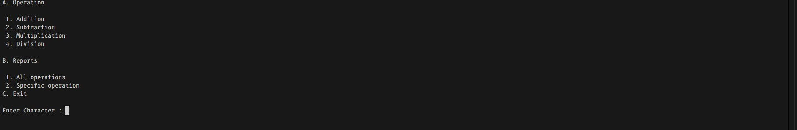
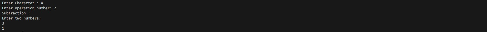
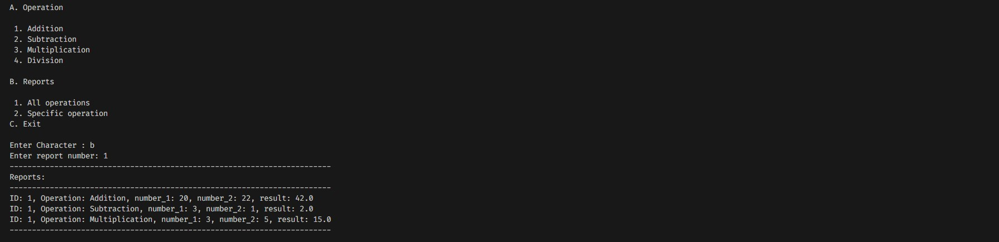
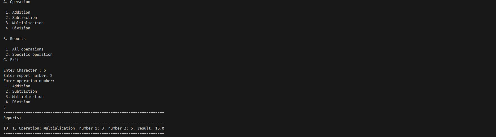

# 📁 Files project

Programming method 5th project. mathematical management standalone java app

### Features ✨

- ✅ User can processing (addition, subtraction, multiplication, division).
- ✅ Store the results in text files in orginized way.
- ✅ User can processing (addition, subtraction, multiplication, division).

## Take a look 📸

 

 

 

